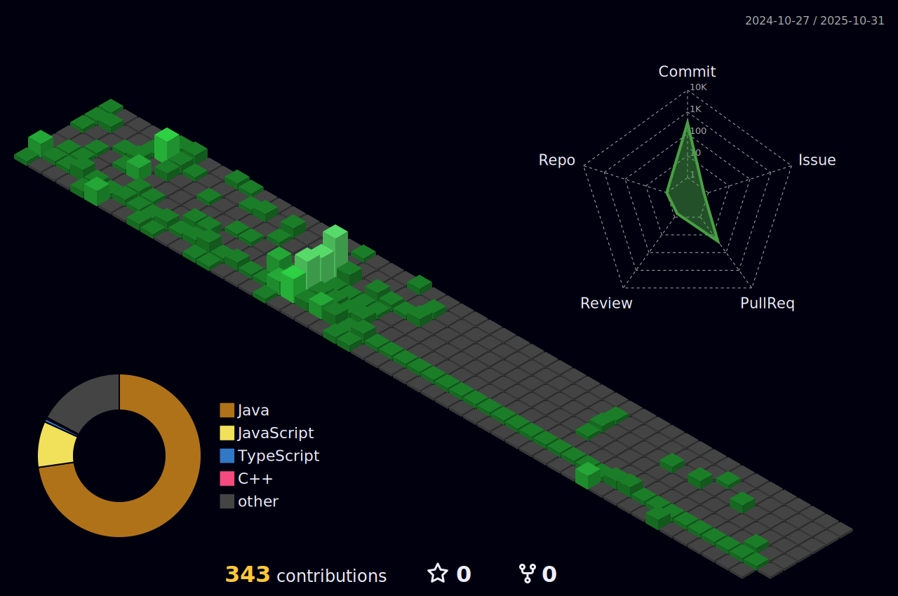

<!-- 

  
  
  

 -->

<!--
<h2>⛏ Skill</h2>

  <h3>Languages</h3>
  
  
  
  
  
  
  

-->
<!--

  <h3>Frameworks</h3>
  
  
  

-->
<!--

  <h3>Databases</h3>
  
  

-->
<!--

  <h3>Etc</h3>
  
  
  
  
  
  

-->
<!--

-->
<!--
<h2>📚Education</h2>

-->
<!--
- [인하대학교 정보통신공학과 학사](https://ice.inha.ac.kr/ice/index.do) | 2019.03 ~
- [메타버스 아카데미 2기 - 서버개발 수료](https://mtvs.kr/user/main) | 2023.06 ~ 2023.11          
-->
<!--

-->
<!--
<h2>💼Career</h2>

<!--
- [NHN Cloud API개발](https://www.nhncloud.com/kr) | 2024.01.02 ~ 2024.02.29       
<!--

 
-->

